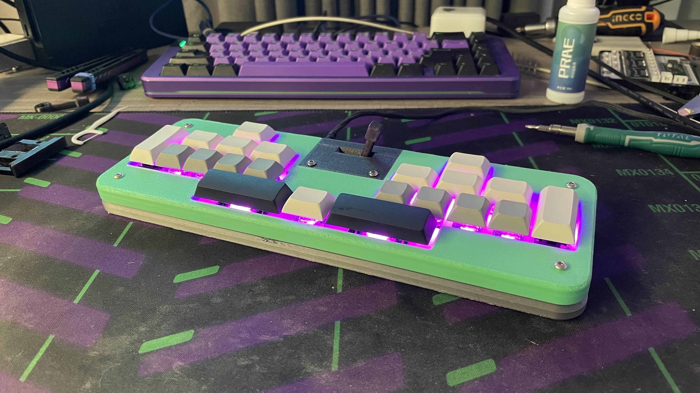
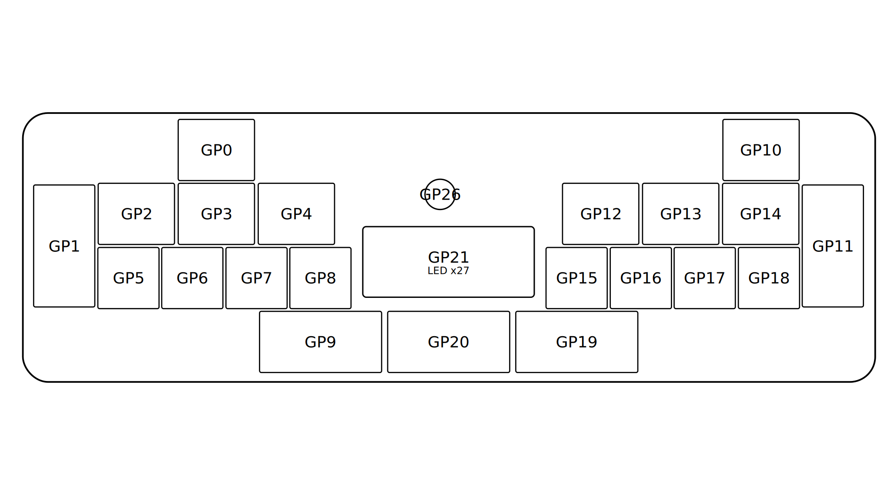

# gekimax

generic rhythm game keypad controller with a lever

## BOM (LCSC, also see [the csv](gekimax-pcb/gekimax.csv))

| Part | Amount |
|---|---|
| RK09L11 Rotary Potentiometer | 1 |
| 100nF Capacitor 0805 | 28 |
| SK6812MINI-E LED | 21 |
| USB-C Connector | 5 |
| 220Ω Resistor 0603 | 1 |
| 5.1KΩ Resistor 0603 | 2 |

*RK09 potentiometer may need some disassembly and modding to remove detent*

## BOM (Additional Hardware)

| Part | Amount |
|---|---|
| Raspberry Pi Pico | 1 |
| M3 Heat Insert | 6 |
| M3 Nut | 2 |
| M3x15-16mm Countersunk Screw | 8 |
| M3x40 Button Head Screw | 1 |
| Rubber Feet | 4 |
| Rubber sheet/padding for lever | 1 |
| Keyboard Switches | 21 |
| Hot Swap Socket | 21 |
| Plate Mount Stabilizer | 4 |
| 1U keycaps | 8 |
| 1.25U keycaps | 9 |
| 2U keycaps | 2 |
| 2.75U keycaps | 2 |

## Notes
- Uses [GP2040-CE](https://gp2040-ce.info/) for firmware (need some manual key mapping)
- PCB has some additional side leds that I couldn't get them to work
